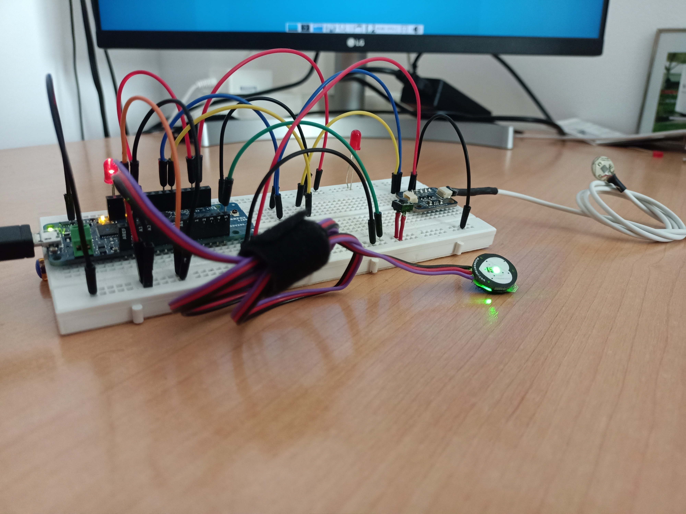
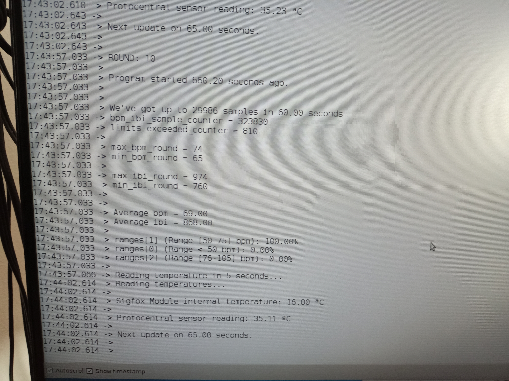

# Patient's heart rate and temperature monitoring system on ARDUINO MKRFOX1200

This project aims to be a monitoring system for aged people based on the ARDUINO MKRFOX1200 board and a couple of sensors atached to it that will monitor heart rate and temperature body measurements. The board will ship a set of metrics based on data recorded by these sensors throug Sigfox's network, which is accessible through its library for this board and an already included data plan. Data will be gathered, buffered and processed on our Monitoring Service, which, in turn, will make them available to the medical team and related people through a web interface. Our Monitoring Service will implement some additional functionalities like notifying an emergency condition to the predefined telephone numbers via Telegram or SMS systems.

## Sketches

We provide two sketches. One is the main program [monitor.ino](https://github.com/carlossaav/Patient-monitoring-with-Sigfox/blob/master/mkrfox1200/src/monitor/monitor.ino), where our Patient Monitoring system is implemented, and another one for testing purposes and calculations on the set of samples, [measures.ino](https://github.com/carlossaav/Patient-monitoring-with-Sigfox/blob/master/mkrfox1200/src/test/measures/measures.ino).

## Sensors, leds and button attached to our ArduinoMKRFOX1200 board

We'll make use of a couple of sensors to achieve our monitoring goals:

1. The first one is our heart rate sensor, named [PulseSensor](https://github.com/WorldFamousElectronics/PulseSensorPlayground) by its developers, which provide a library that we'll include in our sketches to get measurements like Beats Per Minute (bpm) and InterBeat Interval (ibi), for example.

2. The second one is the [Protocentral MAX30205](https://github.com/Protocentral/Protocentral_MAX30205) digital temperature sensor, which also provides a library to make human body temperature measurements available in our sketches.

Lastly, we'll connect a couple of LEDS to our Arduino Board:

1. An Emergency LED, to make visible an alarm condition whenever the patient pushes the alarm button

2. The Sensors LED, to show that there's an error on some of the sensors, or both. In absence of errors, this sensor, if configured, will blink with every heart beat.

3. There's also a third LED, already included on the board, that flashes up when Sigfox module is working, or in debug mode.

- Additionally, we'll attach a button to enable manual alarm notifications from the patient

## Connecting sensors to the board

There's a lot of documentation on how connecting these sensors to Arduino Boards provided, for instance, on the links of the repos above.

Nonetheless, we'll put a simple schema here on how connecting the pins, given that this board works with 3.3V

**PulseSensor**

- Connect analog pin A0 (or any other analog pin) to sensor's signal wire
- Connect VCC (3.3V) from Arduino to VDD of PulseSensor*
- Connect GND pin to GND PulseSensor's wire.

***This is an important step, since maximum output voltage (hence maximum input voltage on A0) from the sensor will be VDD. Having an input higher to 3.3V on any of the pins may damage the board**.

**MAX30205 Temperature Sensor**

- Connect Arduino VCC to 3V3 pin of MAX30205 digital sensor
- Connect GND pin to MAX30205 GND pin.
- Connect Arduino SDA to MAX30205 SDA pin.
- Connect Arduino SCL to MAX30205 SCL pin.

## Shipment logic

We define several shipment policies to accomplish different shipment rates in different patient situations:

- **Regular shipment rate**: In absence of emergency conditions or the need for broader message distribution, the regular shipment rate will deliver messages to the Sigfox Backend every 10 minutes and a half.

- **Emergency policy**: This is the highest shipment rate, thought to meet the most critical reporting needs from the medical point of view, since it's triggered in situations where, according to the measurements recorded from the sensors attached to the device, the patient is in trouble, or it was the very patient that pressed the emergency button at any point on the last sampling interval.

- **Recovery shipment policy**: There are situations where the limit of the messages per day rate fixed by Sigfox could be reached prior to the end of the day, so we define a shipment policy that will distribute the delivery of the messages on larger intervals to avoid reaching such limit and, as a consequence, spending long periods of time without reporting patient updates.

## Message types

There are several types of messages that our ArduinoMKRFOX1200 will send to the Monitoring Service:

- **ERROR_MSG**: Some error happened on any of the sensors.

- **REPORT_MSG**: Sent in normal conditions. That is no errors on the sensors, absence of limits exceeded, and the user didn't press the alarm 
button.

- **LIMITS_MSG**: Sent whenever the device records a limit exceeded.

- **REC_LIMITS_MSG**: LIMITS_MSG recovery message.

- **ALARM_MSG**: The user pressed the alarm button on the device at some point on the last sampling interval.

- **REC_ALARM_MSG**: ALARM_MSG recovery message.

- **ALARM_LIMITS_MSG**: On last sampling interval, the user pressed the alarm button and some exceeded limit has been detected.

- **REC_ALARM_LIMITS_MSG**: ALARM_LIMITS_MSG recovery message.

## Uplink Payload Format

Our ArduinoMKRFOX1200 patient monitoring program will deliver messages to the Sigfox backend following a specific format. Let's establish a terminology to make things easier:

- **e**:    emergency bit (1 bit)
- **r**:    emergency reason payload (1 bit)
- **p**:    shipment policy (2 bits)
- **msg**:  message type (3 bits)
- **rpv**:  bpm ranges fields + payload variant (3 bytes + 9 control bits)
- **avb**:  average bpm of the interval (1 byte)
- **maxb**: highest record of bpm variable on the interval (1 byte)
- **minb**: lowest record of bpm variable on the interval (1 byte)
- **avi**:  average interbeat interval (ibi) of the (sampling) interval (2 bytes)
- **maxi**: highest record of interbeat interval (ibi) variable on the (sampling) interval (2 bytes)
- **mini**: lowest record of interbeat interval (ibi) variable on the (sampling) interval (2 bytes)
- **t**:    temperature record of the interval (4 bytes)
- **x**:    elapsed milliseconds since the recovery message was stored (4 bytes)

* Uplink Payload Format Variants (12 bytes):

-  e:r:p:msg:rpv:avb:maxb:minb:t                                                   (**0**)
-  e:r:p:msg:rpv:avb:maxb:minb:maxi:mini                                           (**1**)
-  e:r:p:msg:rpv:avb:avi:t                                                         (**2**)
-  e:r:p:msg:rpv:avb:avi:maxi:mini                                                 (**3**)
-  e:r:p:msg:rpv:avb(0):t (PulseSensor Error, on ERROR_MSG)                        (**4**)
-  (original_payload-(last 4 bytes)):x                                             (**5**)

**Notes on control fields**

- emergency bit (**e field**) set to 0 indicates there's no ongoing emergency at the device's end, therefore patient has not pressed the emergency button, nor any automatic emergency condition has been detected so far or, at least, since last emergency. Bit set to 1 indicates the opposite.

- Emergency reason payload (**r field**) set to 1 indicates that this payload is the original reason from the current emergency, which was triggered at the detection of any of the triggering emergency conditions (manual or automatic).

- Shipment policy bits (**p field**):

* **00**: No policies active. Regular shipment rate
* **01**: Emergency shipment policy is active
* **10**: Recovery shipment policy is active
* **11**: Device's first message after booting (Only in case of abscense of emergency conditions)

- Message type (**msg field**): Indicates the message type of the payload.

- Bpm ranges fields + Payload format variant (**rpv field**): Looking to the first control bit from every value (percentage) from this field, we compound a three-bit indicator that lets the service know what kind of payload will have to process. The whole rpv field looks like this, having:

  - xxx: range id bits
  - i: n-bit of the three-bit payload format indicator
  - r: positive integer numerator of the fraction r/100 (7 bits)

  rpv field: xxx:i:r:xxx:i:r:xxx:i:r

  **Given that a percentage won't reach any value higher than 100, we use the the most significant bit (i) from every r value on the rpv field to compound a three-bit indicator of the payload format variant**.

## Downlink Payload Format

Sigfox Downlink messages are shorter than Uplink messages, being an 8-byte packet the largest one allowed. The number of downlink messages per day allowed by Sigfox is reduced to 4.

In this case we'll set a single variant for the payload. First of all, let's define the terminology:

- **rtc**: current time (2 bytes + 1 bit)
- **msg**: total amount of uplink messages sent on the current day. (1 byte)
- **ub**:  upper bpm limit to be set on the Monitoring program (1 byte)
- **lb**:  lower bpm limit to be set on the Monitoring program (1 byte)
- **ut**:  upper temperature limit to be set on the Monitoring program (6 bits)
- **lt**:  lower temperature limit to be set on the Monitoring program (6 bits)
- **bt**:  time in seconds that a bpm limit can be exceeded without triggering an emergency condition (7 bits)
- **bx**:  delay in minutes that must exist between an upper limit exceeded and a lower limit exceeded (4 bits)

* Downlink Payload Format (8 bytes):

- rtc:bt:msg:ub:lb:ut:lt:bx

## Getting measures with [measures.ino](https://github.com/carlossaav/Patient-monitoring-with-Sigfox/blob/master/mkrfox1200/src/test/measures/measures.ino)

Hence, once you have everything setup on your board and cloned the project, you're ready to run our test sketch, [measures.ino](https://github.com/carlossaav/Patient-monitoring-with-Sigfox/blob/master/mkrfox1200/src/test/measures/measures.ino) onto your ArduinoMKRFOX1200.

This sketch is set to run about 12-13 minutes by default, making sampling rounds of 1-2 minutes, but you can change it modifying the corresponding constants at the top of the sketch. At about the end of each round, you should see something like this on your Serial Window:

